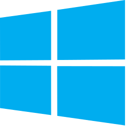
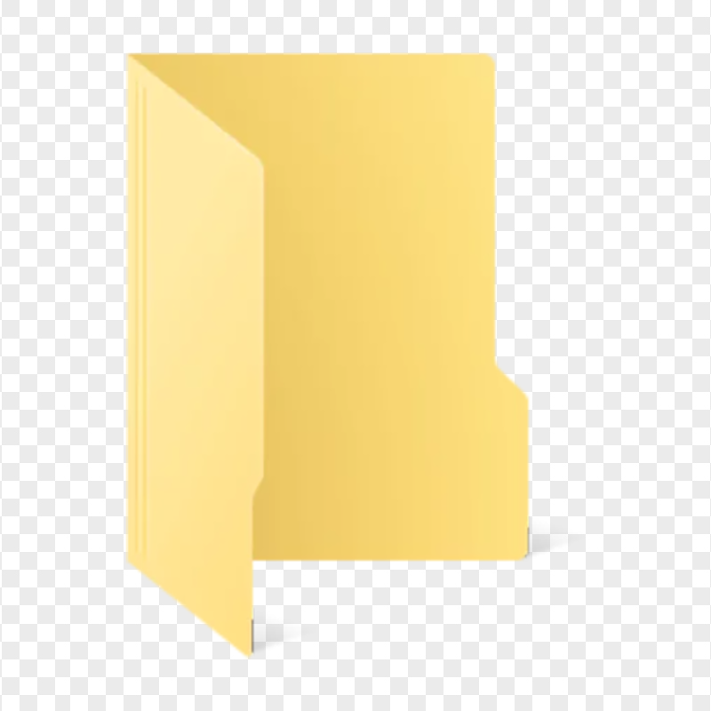
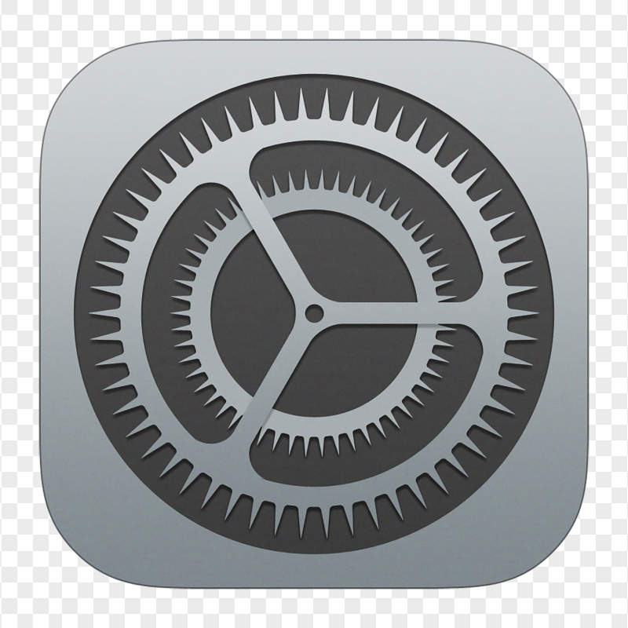

# OScribe

> Vision-based desktop automation MCP server. Control any application via screenshot + AI vision.

[](https://www.npmjs.com/package/oscribe)
[](LICENSE)
[](https://nodejs.org)
[](https://www.typescriptlang.org/)
[](https://github.com/mikealkeal/oscribe)

## Supported Platforms & Applications

<div align="center">

### Operating Systems

<table>
<tr>
  <td align="center" width="150">
    <br/>
    <b>macOS</b>
  </td>
  <td align="center" width="150">
    <br/>
    <b>Windows</b>
  </td>
</tr>
</table>

### Native Applications

<table>
<tr>
  <td align="center" width="150">
    <br/>
    <b>Finder</b><br/>
    <sub>File management</sub>
  </td>
  <td align="center" width="150">
    <br/>
    <b>Explorer</b><br/>
    <sub>File operations</sub>
  </td>
  <td align="center" width="150">
    <br/>
    <b>System Settings</b><br/>
    <sub>macOS & Windows</sub>
  </td>
</tr>
</table>

### Web Browsers (CDP-enhanced)

<table>
<tr>
  <td align="center" width="150">
    <br/>
    <b>Chrome</b><br/>
    <sub>200-300+ elements</sub>
  </td>
  <td align="center" width="150">
    <br/>
    <b>Brave</b><br/>
    <sub>Full CDP support</sub>
  </td>
  <td align="center" width="150">
    <b>Edge, Arc, Opera</b><br/>
    <sub>Chromium-based</sub>
  </td>
</tr>
</table>

**Note:** Chrome 136+ requires automatic profile sync (~20-30s) due to [CDP security changes](https://github.com/browser-use/browser-use/issues/1520).

</div>

## Table of Contents

- [Supported Platforms & Applications](#supported-platforms--applications)
- [Why OScribe?](#why-oscribe)
- [Features](#features)
- [Quick Start](#quick-start)
- [MCP Integration](#mcp-integration)
- [How It Works](#how-it-works)
- [Configuration](#configuration)
- [Troubleshooting](#troubleshooting)
- [License](#license)
- [Acknowledgements](#acknowledgements)

## Why OScribe?

> **"If you can see it, OScribe can click it."**

OScribe is your fallback when traditional automation tools fail:

- **Legacy apps** without APIs
- **Games and canvas apps** without DOM
- **Third-party software** you can't modify
- **Ad-hoc automation** without infrastructure setup

## Features

- 🎯 **Vision-based** - Locate UI elements by description using Claude vision
- 🔍 **UI Automation** - Get element coordinates via Windows accessibility tree
- 🔧 **MCP Server** - Integrates with Claude Desktop, Claude Code, Cursor, Windsurf
- ⚡ **Native Input** - Uses robotjs for reliable mouse/keyboard control
- 📸 **Multi-monitor** - Supports multiple screens with DPI awareness
- 🪟 **Windows** - Currently tested on Windows only
- ⚛️ **Electron Support** - Full UI element detection in Electron apps (via NVDA)

## Quick Start

### Guided Installation (Recommended)

Run our interactive installer that checks and installs all prerequisites for you:

```bash
# macOS/Linux
curl -fsSL https://raw.githubusercontent.com/mikealkeal/oscribe/main/scripts/install.mjs | node

# Windows (PowerShell as Administrator)
irm https://raw.githubusercontent.com/mikealkeal/oscribe/main/scripts/install.mjs -OutFile install.mjs; node install.mjs
```

The installer will:

1. ✅ Check Node.js version (22+ required)
2. ✅ Check/install Python
3. ✅ Check/install build tools (VS Build Tools or Xcode CLI)
4. ✅ Install OScribe

### Manual Installation

If you prefer manual installation or already have prerequisites:

```bash
npm install -g oscribe
```

Then configure your MCP client (see [MCP Integration](#mcp-integration) below).

## Installation

### System Prerequisites

OScribe uses **robotjs** for native mouse/keyboard control, which requires compilation tools:

#### Windows

1. **Node.js 22+** - [Download](https://nodejs.org/)
2. **Python 3.x** - [Download](https://www.python.org/downloads/) (check "Add to PATH" during install)
3. **Visual Studio Build Tools** - Install with C++ workload:

   ```powershell
   # Option 1: Via npm (recommended)
   npm install -g windows-build-tools

   # Option 2: Manual install
   # Download from https://visualstudio.microsoft.com/visual-cpp-build-tools/
   # Select "Desktop development with C++" workload
   ```

#### macOS

1. **Node.js 22+** - [Download](https://nodejs.org/) or `brew install node`
2. **Xcode Command Line Tools**:

   ```bash
   xcode-select --install
   ```

3. **Python 3.x** - Usually pre-installed, verify with `python3 --version`

#### Verify Prerequisites

**Before installing**, run the diagnostic script to check all prerequisites:

```bash
# macOS/Linux - Run directly without installation
curl -fsSL https://raw.githubusercontent.com/mikealkeal/oscribe/main/scripts/doctor.mjs | node

# Windows (PowerShell)
irm https://raw.githubusercontent.com/mikealkeal/oscribe/main/scripts/doctor.mjs -OutFile doctor.mjs; node doctor.mjs
```

The doctor script checks:

- Node.js version (22+)
- Python installation
- Build tools (VS Build Tools on Windows, Xcode CLI on macOS)

It provides step-by-step fix instructions for any missing prerequisites.

After OScribe is installed, you can also run:

```bash
oscribe doctor
```

### Additional Requirements

- **Claude Desktop, Claude Code, or any MCP client** (provides OAuth authentication)

### From npm (Recommended)

```bash
# Global installation
npm install -g oscribe

# Verify installation
oscribe --version
```

### From Source

```bash
git clone https://github.com/mikealkeal/oscribe.git
cd oscribe
npm install
npm run build
npm link  # Makes 'oscribe' command available globally
```

### Platform Support

| Platform | Status |
| -------- | ------ |
| Windows  | ✅ Fully supported |
| macOS    | ✅ Supported |
| Linux    | 🚧 Not tested yet |

#### Windows Details

- PowerShell (included)
- UI Automation via PowerShell + .NET
- NVDA support for Electron apps

#### macOS Details

- Native screencapture command
- UI Automation via AXUIElement API (`ax-reader` binary)
- Requires: **Accessibility permissions** (System Settings → Privacy & Security → Accessibility)
  - Add Terminal or your IDE to allowed apps
  - **IMPORTANT for VSCode users**: You must also authorize VSCode in "App Management" (Login Items & Extensions)
    1. Open System Settings → General → Login Items & Extensions
    2. Find "Visual Studio Code"
    3. Toggle ON the switch
    4. Enter your password or use Touch ID to confirm
    5. This is required for OScribe MCP to control your system from Claude Code
- Native apps (Chrome, Safari, Finder) work well
- Electron apps (VS Code, etc.) have limited element detection (same as Windows without NVDA)

## Usage

### CLI Commands

#### Vision-Based Clicking (The Core of OScribe!)

```bash
oscribe click "Submit button"              # Click by description - the magic!
oscribe click "File menu"                  # Works on any visible element
oscribe click "Export as PNG" --screen 1   # Target specific monitor
oscribe click "Close" --dry-run            # Preview without clicking
```

#### Input & Automation

```bash
oscribe type "hello world"                 # Type text
oscribe hotkey "ctrl+c"                    # Press keyboard shortcut
oscribe hotkey "ctrl+shift+esc"            # Multiple modifiers
```

#### Screenshots

```bash
oscribe screenshot                      # Capture primary screen
oscribe screenshot -o capture.png       # Save to file
oscribe screenshot --screen 1           # Capture second monitor
oscribe screenshot --list               # List available screens
oscribe screenshot --describe           # Describe screen content with AI
```

#### Window Management

```bash
oscribe windows                         # List open windows
oscribe focus "Chrome"                  # Focus window by name
oscribe focus "Calculator"              # Works with partial matches
```

#### MCP Server

```bash
oscribe serve                          # Start MCP server (stdio transport)
```

### Global Options

```bash
--verbose, -v          # Detailed output
--dry-run              # Simulate without executing
--quiet, -q            # Minimal output
--screen N             # Target specific screen (default: 0)
```

### Examples

```bash
# Take screenshot and save
oscribe screenshot -o desktop.png

# Type with delay between keystrokes
oscribe type "slow typing" --delay 100

# Use second monitor
oscribe screenshot --screen 1 --describe

# Dry run to see what would happen
oscribe type "test" --dry-run
```

## MCP Integration

OScribe exposes tools via [Model Context Protocol](https://modelcontextprotocol.io) for AI agents. Works with **Claude Desktop**, **Claude Code**, **Cursor**, **Windsurf**, and any MCP-compatible client.

### Quick Setup

#### Claude Desktop

Edit your config file:

| OS      | Config Path                                              |
| ------- | -------------------------------------------------------- |
| Windows | `%APPDATA%\Claude\claude_desktop_config.json`            |
| macOS   | `~/Library/Application Support/Claude/claude_desktop_config.json` |

Add OScribe to `mcpServers`:

```json
{
  "mcpServers": {
    "oscribe": {
      "command": "npx",
      "args": ["-y", "oscribe", "serve"]
    }
  }
}
```

Or if installed globally (`npm install -g oscribe`):

```json
{
  "mcpServers": {
    "oscribe": {
      "command": "oscribe",
      "args": ["serve"]
    }
  }
}
```

Then **restart Claude Desktop**. You'll see a 🔌 icon indicating MCP tools are available.

#### Claude Code / Cursor / Windsurf

Add a `.mcp.json` file in your project root:

```json
{
  "mcpServers": {
    "oscribe": {
      "command": "npx",
      "args": ["-y", "oscribe", "serve"]
    }
  }
}
```

Or if installed globally:

```json
{
  "mcpServers": {
    "oscribe": {
      "command": "oscribe",
      "args": ["serve"]
    }
  }
}
```

### Available MCP Tools

| Tool             | Description                                            | Parameters                         |
| ---------------- | ------------------------------------------------------ | ---------------------------------- |
| `os_screenshot`  | 📸 Capture screenshot + cursor position                | `screen?` (default: 0)             |
| `os_inspect`     | 🔍 **Get UI elements via Windows UI Automation**       | `window?`                          |
| `os_inspect_at`  | 🎯 Get element info at coordinates                     | `x`, `y`                           |
| `os_move`        | Move mouse cursor                                      | `x`, `y`                           |
| `os_click`       | Click at current cursor position                       | `window?`, `button?`               |
| `os_click_at`    | Move + click in one action                             | `x`, `y`, `window?`, `button?`     |
| `os_type`        | Type text                                              | `text`                             |
| `os_hotkey`      | Press keyboard shortcut                                | `keys` (e.g., "ctrl+c")            |
| `os_scroll`      | Scroll in direction                                    | `direction`, `amount?`             |
| `os_windows`     | List open windows + screens                            | -                                  |
| `os_focus`       | Focus window by name                                   | `window`                           |
| `os_wait`        | Wait for duration (UI loading)                         | `ms` (max 30000)                   |
| `os_nvda_status` | Check NVDA screen reader status (Electron support)     | -                                  |
| `os_nvda_install`| Download NVDA portable for Electron apps               | -                                  |
| `os_nvda_start`  | Start NVDA in silent mode                              | -                                  |
| `os_nvda_stop`   | Stop NVDA screen reader                                | -                                  |

### MCP Usage Example

Once configured, Claude can automate your desktop:

> "Take a screenshot and describe what you see"

> "Inspect the UI elements and click the Submit button"

> "List all windows and focus on Chrome"

> "Type 'hello world' and press Ctrl+Enter"

**Workflow**: Claude uses `os_screenshot` to see the screen, `os_inspect` to get element coordinates, then `os_move` + `os_click` for precise interaction.

## Configuration

Config directory: `~/.oscribe/`

### Files

- **`config.json`** - Application settings

### config.json

```json
{
  "defaultScreen": 0,
  "dryRun": false,
  "logLevel": "info",
  "cursorSize": 128
}
```

### Configuration Options

| Option          | Type    | Default  | Description                                 |
| --------------- | ------- | -------- | ------------------------------------------- |
| `defaultScreen` | number  | `0`      | Default monitor to capture                  |
| `dryRun`        | boolean | `false`  | Simulate actions without executing          |
| `logLevel`      | string  | `"info"` | Log level: `debug`, `info`, `warn`, `error` |
| `cursorSize`    | number  | `128`    | Cursor size in screenshots (32-256)         |
| `nvda.autoDownload` | boolean | `false` | Auto-download NVDA when needed           |
| `nvda.autoStart`    | boolean | `true`  | Auto-start NVDA for Electron apps        |
| `nvda.customPath`   | string  | -       | Custom NVDA installation path            |

## How It Works

OScribe uses a multi-layer approach for desktop automation (Windows):

1. **Screenshot Layer** - Captures screen using PowerShell + .NET System.Drawing

2. **UI Automation Layer** - Gets element coordinates via Windows accessibility tree:
   - Uses Windows UI Automation API via PowerShell
   - Returns interactive elements with screen coordinates
   - Works like a DOM for desktop apps

3. **Input Layer** - Uses robotjs for:
   - Mouse movement and clicks
   - Keyboard input and hotkeys
   - Adapts to Windows mouse button swap settings

**Best strategy**: Use `os_screenshot` which returns UI elements with coordinates, then `os_move` + `os_click` for precise interaction.

## Development

### Setup

```bash
git clone https://github.com/mikealkeal/oscribe.git
cd oscribe
npm install
```

### Scripts

```bash
npm run build       # Build TypeScript
npm run dev         # Development mode (watch)
npm run typecheck   # Type check only
npm run lint        # Run ESLint
npm run lint:fix    # Fix linting issues
npm run format      # Format with Prettier
npm run clean       # Remove dist folder
```

### Project Structure

```
oscribe/
├── bin/
│   └── oscribe.ts              # CLI entry point
├── src/
│   ├── core/
│   │   ├── screenshot.ts     # Multi-platform screen capture
│   │   ├── input.ts          # Mouse/keyboard control (robotjs)
│   │   ├── windows.ts        # Window management
│   │   └── uiautomation.ts   # Windows UI Automation (accessibility)
│   ├── cli/
│   │   ├── commands/         # CLI command implementations
│   │   └── index.ts          # Command registration
│   ├── mcp/
│   │   └── server.ts         # MCP server (12 tools)
│   ├── config/
│   │   └── index.ts          # Config management with Zod
│   └── index.ts              # Main exports
├── package.json
├── tsconfig.json
├── .env.example
└── LICENSE
```

### Tech Stack

- **Runtime**: Node.js 22+ (ESM)
- **Language**: TypeScript 5.7+ (strict mode)
- **Validation**: Zod
- **CLI**: Commander + Chalk + Ora
- **Vision**: Anthropic SDK (Claude Sonnet 4)
- **Input**: robotjs (native automation)
- **Screenshot**: screenshot-desktop + platform-specific tools
- **MCP**: @modelcontextprotocol/sdk

## Troubleshooting

### Installation Issues

**`npm install` fails with node-gyp errors:**

First, run the diagnostic script (no installation required):

```bash
# macOS/Linux
curl -fsSL https://raw.githubusercontent.com/mikealkeal/oscribe/main/scripts/doctor.mjs | node

# Windows (PowerShell)
irm https://raw.githubusercontent.com/mikealkeal/oscribe/main/scripts/doctor.mjs -OutFile doctor.mjs; node doctor.mjs
```

This is usually due to missing build tools. robotjs requires native compilation.

```bash
# Error examples:
# - "gyp ERR! find Python"
# - "gyp ERR! find VS"
# - "node-pre-gyp ERR! build error"
```

**Windows fix:**

```powershell
# 1. Install Python (if missing)
# Download from https://www.python.org/downloads/
# IMPORTANT: Check "Add Python to PATH" during installation

# 2. Install Visual Studio Build Tools
npm install -g windows-build-tools

# Or manually: download from https://visualstudio.microsoft.com/visual-cpp-build-tools/
# Select "Desktop development with C++" workload

# 3. Retry installation
npm install -g oscribe
```

**macOS fix:**

```bash
# 1. Install Xcode Command Line Tools
xcode-select --install

# 2. Retry installation
npm install -g oscribe
```

**Still failing?** Try clearing npm cache:

```bash
npm cache clean --force
npm install -g oscribe
```

### MCP Server Issues

**Server not starting:**

- Check Node.js version: `node --version` (requires 22+)
- Rebuild if needed: `npm run build`
- Check path in your MCP config file

**Tools not appearing in Claude Desktop:**

- Restart Claude Desktop after config changes
- Check `claude_desktop_config.json` syntax (valid JSON)
- Look for 🔌 icon in Claude Desktop interface

### Windows Issues

**Clicks not working:**

- OScribe auto-detects swapped mouse buttons
- No manual configuration needed

**UI elements not detected:**

- Some apps don't expose UI Automation elements
- Use `os_screenshot` to see what's visible
- Coordinates are returned in the screenshot response

**Electron apps showing few UI elements:**

Electron/Chromium apps require NVDA screen reader to expose their full accessibility tree:

```bash
# Install NVDA portable (one-time)
oscribe nvda install

# Start NVDA silently (no audio)
oscribe nvda start
```

Or via MCP tools: `os_nvda_install` → `os_nvda_start`

NVDA runs in silent mode (no speech, no sounds). The agent will prompt to install NVDA when needed.

**Manual NVDA installation:**

If you prefer to install NVDA yourself, download from [nvaccess.org](https://www.nvaccess.org/download/) and set the path in config:

```json
{
  "nvda": {
    "customPath": "C:/Program Files/NVDA"
  }
}
```

## License

**BSL 1.1** (Business Source License 1.1)

- ✅ **Free** for personal use
- ✅ **Free** for open-source projects
- ⚠️ **Commercial use** requires a paid license (until 2029)
- 🔄 Converts to **MIT** on 2029-01-30 (then free for everyone)

See [LICENSE](LICENSE) for full terms.

## Contributing

Contributions are welcome! Please feel free to submit a Pull Request.

### Guidelines

1. Follow the existing code style (ESLint + Prettier configured)
2. Add tests for new features
3. Update documentation as needed
4. Ensure `npm run build` succeeds
5. Check types with `npm run typecheck`

### Areas for Contribution

- [ ] Additional platform support (BSD, other Unix variants)
- [ ] More sophisticated element location strategies
- [ ] Performance optimizations
- [ ] Additional MCP tools
- [ ] Better error messages
- [ ] Documentation improvements

## Support

- 🐛 **Bug reports**: [GitHub Issues](https://github.com/mikealkeal/oscribe/issues)
- 💬 **Questions**: [GitHub Discussions](https://github.com/mikealkeal/oscribe/discussions)
- 📖 **Documentation**: This README + inline code comments

## Roadmap

- [x] npm package distribution
- [ ] Web interface for remote control
- [ ] Recording and playback of automation sequences
- [ ] Multi-provider vision support (GPT-4V, Gemini)
- [ ] Plugin system for custom tools
- [ ] Docker container distribution

## Acknowledgements

OScribe is built on top of these great open-source projects:

- [robotjs](https://github.com/octalmage/robotjs) - Native mouse/keyboard control
- [screenshot-desktop](https://github.com/nicholasserra/screenshot-desktop) - Cross-platform screen capture
- [@anthropic-ai/sdk](https://github.com/anthropics/anthropic-sdk-typescript) - Claude API client
- [@modelcontextprotocol/sdk](https://github.com/modelcontextprotocol/sdk) - MCP server framework
- [ffmpeg](https://ffmpeg.org/) - GIF generation (optional, external)

---

**Maintained by [Mickaël Bellun](https://bellun.fr)**
